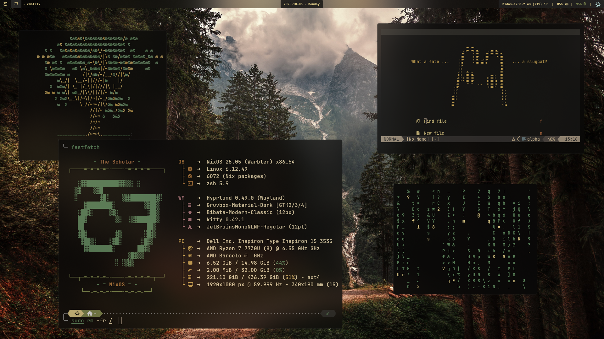
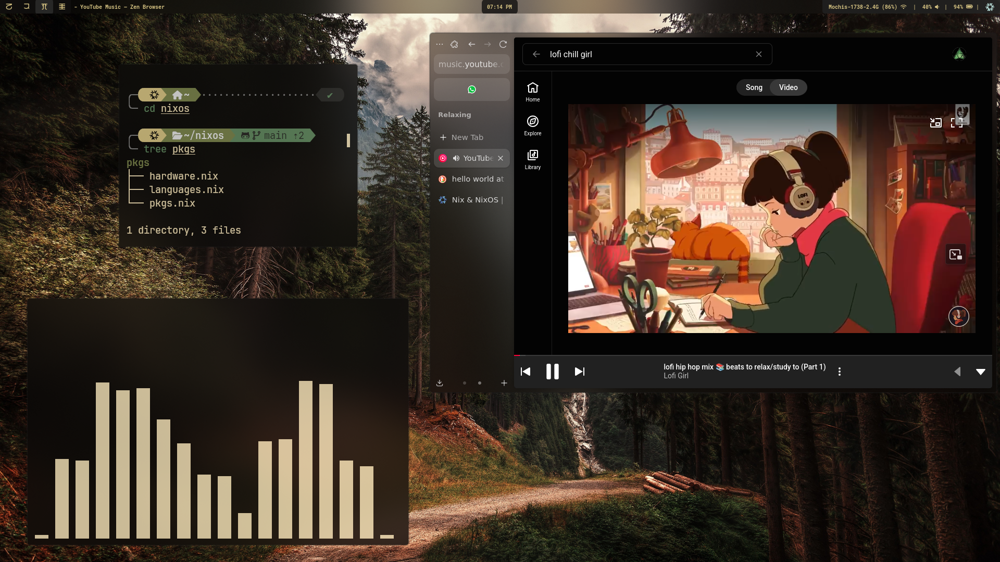
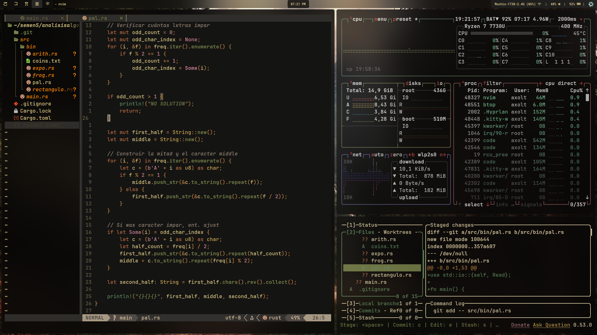

<h1 align='center'>
 AxoltDash Dotfiles
</h1>

¡Bienvenido a mi colección personal de dotfiles! Este repositorio contiene mis configuraciones personalizadas para diversos programas y mi sistema operativo NixOS.

<h2 align='center'>
 Ideas y tema principal de estos Dotfiles
</h2>

El tema principal de estos dotfiles es:
- Lograr una apariencia inspirada en la naturaleza, evitando el exceso de verde y transmitiendo la sensación de trabajar con madera.
- Sentirte como en un video de fondo de música lofi-chill.
- Incorporar simbología de uno de mis videojuegos favoritos: "Rain World".
- Disminuir al máximo la luz azul, para poder dormir mejor durante las desveladas de "chambing".

Existen temas que la comunidad desarrolla como Gruvbox o Everforest, y hay extensiones para muchas aplicaciones basadas en ellos. Sin embargo, Gruvbox busca un aire retro y Everforest abusa de fondos muy brillantes y verdes musgosos. Mis dotfiles combinan ambas sensaciones en una paleta única que por ahora llamo **LightMoss**.

<p align="center">
  
  
  
</p>

> Nota: el [fondo de pantalla](assets/forest-mountain.jpg) se encuentra en [`assets/`](assets/)


<p align="center">
  
</p>

## Historia de origen de estos Dotfiles

Al inicio de la carrera de Ciencias de la Computación tuve una computadora bastante mala; de hecho, funcionaba gracias a cinta adhesiva y kola-loka para que encendiera y funcionara (una vez me regañaron en un laboratorio por desarmarla en plena clase). Esta laptop tardaba varios minutos en iniciar Ubuntu y/o Fedora, por lo que un día me harté y decidí instalar una distro ligera.

Después de investigar, instalar y empezar a usar Arch Linux con lo más minimalista posible, me fui introduciendo al mundo de los dotfiles, ya que tarde o temprano, usando distros como Arch, te tienes que enfrentar a ello.

Así comenzó la configuración de estos dotfiles hace justo un año. Al principio modificaba solo lo esencial para que funcionara lo mínimo posible; se veía horrible y solo trataba de poner lo que medianamente funcionara. Pero con el paso de los meses fui unificando los colores, creé mi propia paleta y puse todo lo más limpio y eficiente posible.

Todo iba bien hasta que mi laptop empezó a dar sus últimos respiros: la pantalla parpadeaba y la kola-loka ya no era suficiente para mantener el ventilador funcionando por más de dos semanas. Con esfuerzo logré obtener mi primera laptop decente y, junto a ella, la distribución NixOS. Trasladé mis antiguos dotfiles a la nueva computadora y empecé a usar NixOS, que es una distribución que sigue la filosofía de los dotfiles: "Todo se encuentra declarado en un conjunto de archivos". Ya no solo tenía el "cómo" se veían mis aplicaciones en archivos, sino que TODO mi sistema operativo estaba declarado.

Debido a que ya ha pasado mucho tiempo desde que creé estos archivos, muchos de los creadores e inspiraciones que tomé se han perdido con el tiempo. Lo que puedo decirte es que al menos el 90% es código propio, ya que varias cosas son difíciles de encontrar en la documentación. Así que te invito a que tomes inspiración de estos archivos para que puedas expandir tus propios caminos en el mundo del ricing.

## ¿Qué es todo esto? (Introducción)

Si eres nuevo en el mundo del **"ricing"** (personalización de tu escritorio Linux), aquí tienes una explicación rápida:

### ¿Qué es el "Ricing"?
**Ricing** es el término que usa la comunidad Linux para referirse a la personalización profunda del escritorio y las aplicaciones. El objetivo es hacer que tu sistema se vea y funcione exactamente como tú quieres.

### ¿Qué son los "Dotfiles"?
Los **dotfiles** son archivos de configuración que comienzan con un punto (.) y están ocultos por defecto. Estos archivos controlan cómo se ven y comportan tus aplicaciones:
- `.bashrc` - Configuración de tu terminal
- `.vimrc` - Configuración de Vim/Neovim
- `.config/waybar/config` - Configuración de la barra de estado
- Y muchos más...

### ¿Qué es "NixOS"?

**NixOS** es una distribución de Linux especial que gestiona todo el sistema a través de archivos de configuración. Es como tener "dotfiles" para todo tu sistema operativo:
- **Ventajas**: Sistema reproducible, fácil rollback, configuración declarativa
- **Desventajas**: Curva de aprendizaje pronunciada
- **¿Lo necesito?**: ¡NO! Puedes usar los dotfiles individuales en cualquier distribución
**NixOS** es una distribución de Linux especial que gestiona todo el sistema a través de archivos de configuración. Es como tener "dotfiles" para todo tu sistema operativo:
- **Ventajas**: Sistema reproducible, fácil rollback, configuración declarativa
- **Desventajas**: Curva de aprendizaje pronunciada
- **¿Lo necesito?**: ¡NO! Puedes usar los dotfiles individuales en cualquier distribución

<p align="center">
  
</p>

### Términos que verás aquí:
- **Wayland**: Protocolo moderno para mostrar ventanas (reemplazo de X11)
- **Hyprland**: Un "compositor" - básicamente tu gestor de ventanas para Wayland
- **Waybar**: Una barra superior/inferior que muestra información del sistema
- **Home Manager**: Herramienta de NixOS para gestionar configuraciones de usuario
- **Flakes**: Sistema moderno de NixOS para gestionar dependencias

## Estructura del Repositorio

```
AxoltDash/
├── nixfiles/     # Mi configuración de NixOS
├── dotfiles/     # Mis Dorfiles
```

Dentro de cada directorio hay un `README.md`, léelo para saber qué necesitas instalar o para qué sirve cada cosa

## NixOS Configuration (Completamente Opcional)

> **⚠️ IMPORTANTE**: La configuración de NixOS es completamente **OPCIONAL**. No necesitas usar NixOS para aprovechar los dotfiles de las aplicaciones individuales.

La carpeta `nixfiles/` contiene mi configuración completa del sistema operativo NixOS. Esta incluye:

- **Sistema base**: Configuración del kernel, drivers y servicios
- **Entorno de escritorio**: Hyprland, Waybar y aplicaciones relacionadas
- **Paquetes**: Todas las aplicaciones que uso regularmente
- **Home Manager**: Gestión declarativa de la configuración del usuario

Si usas NixOS y quieres replicar mi sistema completo, puedes usar estos archivos. Para más detalles, consulta el [README de nixfiles](nixfiles/README.md).

## Dotfiles Individuales

Los dotfiles en la carpeta `dotfiles/` están diseñados para ser **independientes del sistema operativo**. Puedes usar estas configuraciones en:

- **Arch Linux**
- **Ubuntu/Debian**  
- **Fedora**
- **Cualquier distribución de Linux**

### Aplicaciones Configuradas principales

#### Entorno de Escritorio
- **[Hyprland](dotfiles/hypr/)**: Window Manager
  - `hyprland.conf` - Configuración principal con atajos y reglas de ventana
  - `hyprlock.conf` - Pantalla de bloqueo personalizada
  - `hyprpaper.conf` - Gestor de wallpapers
  - `scripts/` - Scripts de utilidad (notificaciones de batería, etc.)

- **[Waybar](dotfiles/waybar/)**: Barra de estado
  - `config.jsonc` - Configuración de módulos y layout
  - `style.css` - Estilos visuales personalizados
  - `scripts/` - Scripts para filtro de luz azul y más

#### Aplicaciones
- **[Kitty](dotfiles/kitty/)**: Terminal GPU-accelerated con tema LightMoss
- **[Neovim](dotfiles/nvim/)**: Editor completamente configurado con plugins (con Copilot integrado, autocompletado, visualmente goooooood)
- **[Rofi](dotfiles/rofi/)**: Lanzador de aplicaciones con un script para lanzar tus propios comandos sin terminal
- **[Btop](dotfiles/btop/)**: Monitor de sistema (Task manager)
- **[Fastfetch](dotfiles/fastfetch/)**: Información del sistema con un simbolo de Rainworld (El erudito)
- **[Zathura](dotfiles/zathura/)**: Visor de PDF minimalista y rápido

## Instalación Rápida

### Opción 1: Solo Dotfiles (Recomendado para la mayoría)

```bash
# Clona el repositorio
git clone https://github.com/Sudo-FCiencias/sudo_dotfiles.git
cd sudo_dotfiles/AxoltDash/dotfiles

# Ejemplo: Instalar configuración de Kitty
cp -r kitty/ ~/.config/

# Ejemplo: Instalar configuración de Neovim
cp -r nvim/ ~/.config/

# Ejemplo: Instalar configuración de Hyprland
cp -r hypr/ ~/.config/

# O crea enlaces simbólicos para actualizaciones automáticas
ln -sf $(pwd)/kitty ~/.config/
ln -sf $(pwd)/nvim ~/.config/
```
No solo necesitas los archivos, necesitas instalar las aplicaciones necesarias. Checa la documentación de `dotfiles/README.md`.

### Opción 2: Sistema Completo NixOS (Solo para usuarios de NixOS)

```bash
# Clona el repositorio
git clone https://github.com/Sudo-FCiencias/sudo_dotfiles.git
cd sudo_dotfiles/AxoltDash/nixfiles

# Reconstruye el sistema (requiere NixOS)
sudo nixos-rebuild switch --flake .
```
Eso sí, he de advertir que `nixfiles/` es una copia modificada de un repositorio personal privado para poder compartirlo aquí en el showcase, pero no está destinado para que sea usado directamente (Tiene paquetes que están destinados a mi tipo de hardware por ejemplo). Así que la documentación no es la mejor, úsalo como referencia, no como uso directo. 

## ⚠️ Advertencias Importantes

1. **Personalización**: Estos dotfiles están adaptados a mis necesidades específicas
2. **Backup**: Siempre haz un respaldo de tus configuraciones actuales antes de usar las mías
3. **Compatibilidad**: Revisa los requisitos de cada aplicación antes de instalar
4. **NixOS Opcional**: No necesitas NixOS para usar los dotfiles individuales
5. **Cosas que no están mencionadas en los dotfiles**: Hay cosas que NO se encuentran en las configuraciones de los dotfiles directamente, por ejemplo, los temas GTK y QT son protocolos que se encargan de "colorear" muchas aplicaciones de Linux, esos se instalan por aparte. (Checa el tema [Gruvbox Material GTK](https://github.com/TheGreatMcPain/gruvbox-material-gtk) que es el que yo uso)

## Personalización

Siéntete libre de:
- Modificar las configuraciones según tus necesidades
- Tomar solo las partes que te interesen

## Licencia

Este proyecto está bajo la [Licencia MIT](../LICENSE). Úsalo libremente pero bajo tu propio riesgo.