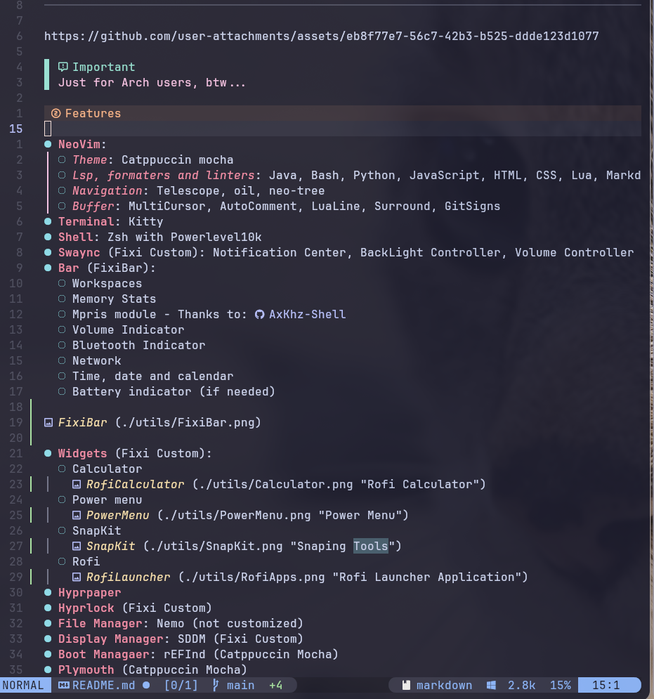

# FixiBar Configs

This repo contains my customizations.

[](https://github.com/fk2731/FixiBar)

## Installation

> [!IMPORTANT]
> Just for Arch users, btw...

```bash
    curl -fsSL https://github.com/fk2731/FixiBar/main/setup.sh | bash
```

---

## Repository Structure

Here’s a brief overview of the main folders and files:

- `boot/` → Boot-related configurations (rEFInd, Plymouth themes, etc.)
- `config/` → General system and app configs
- `Fixi/` → Fixi Custom scripts and modules (Bar, Widgets, etc.)
- `login/` → Login related configs (SDDM tweaks)
- `pacman.conf` → Pacman package manager configuration
- `setup.sh` → Installation script for Arch Linux
- `utils/` → Screenshots

---

> [!CAUTION]
> Takes a fair amount of energy, still...

https://github.com/user-attachments/assets/eb8f77e7-56c7-42b3-b525-ddde123d1077

## Features

- **NeoVim**:
  - _Theme_: Catppuccin mocha
  - _Lsp, formaters and linters_: Java, Bash, Python, JavaScript, HTML, CSS, Lua, Markdown
  - _Navigation_: Telescope, oil, neo-tree
  - _Buffer_: MultiCursor, AutoComment, LuaLine, Surround, GitSigns

    

- **Terminal**: Kitty
- **Shell**: Zsh with Powerlevel10k
- **Swaync** (Fixi Custom): Notification Center, BackLight Controller, Volume Controller
- **Bar** (FixiBar):

  
  - Workspaces
  - Memory Stats
  - Mpris module - Thanks to: [AxKhz-Shell](https://github.com/mariokhz/AxKhz-Shell)
  - Volume Indicator
  - Bluetooth Indicator
  - Network
  - Time, date and calendar
  - Battery indicator (if needed)

    

- **Widgets** (Fixi Custom):
  - Calculator

    

  - Power menu

    

  - Snipping Kit

    

  - Rofi

    

- **Hyprpaper**
- **Hyprlock** (Fixi Custom)
- **File Manager**: Nemo (not customized)
- **Display Manager**: SDDM (Fixi Custom)
- **Boot Managaer**: rEFInd (Catppuccin Mocha)

  

- **Plymouth** (Catppuccin Mocha)

  

  > [!NOTE]
  >
  > - `lsd` is an enhanced `ls` command
  > - `tldr` is an enhanced `man` command
  > - `ogman` is an alias for the original `man` command

## KeyBinds

### Apps

| Action                | KeyBinds  |
| :-------------------- | :-------- |
| Close current app     | Super + C |
| Launch Kitty terminal | Super + Q |
| Launch Swaync         | Super + N |
| Launch Rofi           | Super + R |
| Launch Brave          | Super + B |
| Launch Spotify        | Super + M |
| Launch Calculator     | Super + P |
| Launch Snipping Kit   | Super + Z |
| Launch Power menu     | Super + W |
| Open ChatGPT          | Super + F |
| Open Copilot          | Super + G |
| Launch Telegram       | Super + T |

---

### Navigation & windows

| Action                           | KeyBinds                       |
| :------------------------------- | :----------------------------- |
| Switch window focus in workspace | Alt + Tab                      |
| Move focus left                  | Super + H                      |
| Move focus down                  | Super + J                      |
| Move focus up                    | Super + K                      |
| Move focus right                 | Super + L                      |
| Navigate through workspaces      | Super + Tab                    |
| Move window to another workspace | Super + Shift + &lt;Number&gt; |
| Switch to workspace              | Super + &lt;Number&gt;         |

---

### System

| Action         | KeyBinds          |
| :------------- | :---------------- |
| Launch FixiBar | Super + Shift + B |
| Lock screen    | Super + Shift + L |

---

